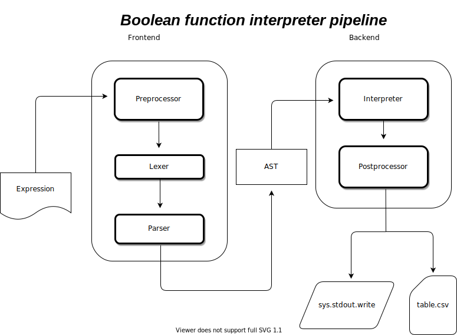

# Python - Boolean Function Interpreter

An interpreter written from scratch in python that can calculate basic boolean functions over the entire truth table or specific values

### Dependencies

|package|version|
|----|-------|
|python|>= 3.9.6|
|pandas|>= 1.3.2|

## How to use

```shell
python3 main.py
```

In the program itself, you will be prompted to the input line, where you must enter the expression, for example:

**(By default, the entire truth table will be saved to the ./output_data/table.csv file and is not shown, flag -v or -s change this behavior (see below))**

```python
prompt> x1 and x2
truth table saved in ./output_data/table.csv
```

in the ./output_data/table.csv

```csv
   x1  x2  expr: x1 and x2
0   0   0                0
1   0   1                0
2   1   0                0
3   1   1                1
```

## Flags

|flag|extend flag|meaning|
|----|-----------|-------|
|-h|--help|for reference|
|-v|--visual| print pd.DataFrame with answers to sys.stdout.write and saves the file to the standard path (default: False)|
|-s|--simple|it just outputs the answer without storing it anywhere (default: False)|
|-e|--expr|You can enter an expression into this flag if you don't want to do it through the main.py|
|-d|--debug|outputs each change to the token array after the functions. Before the Abstract Syntax Tree (default=False)|

## Syntax

### How to write expression?

1. To obtain a complete truth table for variables, 
you can number the variable with letters: x1, x2, x3, a, b, c, d,
var1, var2, varN. But if instead of variables you write {0, 1} - these
are fixed numbers and the expression will be calculated only
for them.
**The author does not recommend using numbers as variable names** i.e. 2, 3, 4, 11, 1231231)

```python
x1 and x2 or x3
```

```python
a and b or c
```

```python
var1 and b or c
```

> *For all expressions above, a truth table will be created for all variations {0, 1} for all variables*

```python
1 or 0 and 1
```

> *For this expression, 1 single answer will be calculated, since the variables are specified by the constant*

2. You **must** put spaces between variables and operators

```python
x1 and x2 nor x3
```

```python
0 or 1 and 0
```

3. Between the operator and the parenthesis, a space is also needed, between the variable and the parenthesis, a space can be omitted

```python
not (x1 or x2)
```

```python
(x1 and x2) or (not x1 or x2)
```

4. Operations in one priority group are calculated from left to right **(The author highly recommends separating operators in one category with brackets)**

> bad practise below

```python
x1 and x2 nand x3
```

> good practise below

```python
(x1 and x2) nand x3
```

#### Which boolean operations supports?

|operation|equivalent for expression|
|----|-------|
|[¬ / Inverter](https://en.wikipedia.org/wiki/Inverter_(logic_gate))|`negation`|
|[∧ / & / logical conjunction](https://en.wikipedia.org/wiki/AND_gate)|`and`|
|[↑ / NAND / Sheffer stroke](https://en.wikipedia.org/wiki/NAND_gate)|`nand`|
|[∨ / logical disjunction](https://en.wikipedia.org/wiki/OR_gate)|`or`|
|[⊕ / exclusive OR / EOR / NE](https://en.wikipedia.org/wiki/XOR_gate)|`xor`|
|[↓ / NOR / Peirce's arrow](https://en.wikipedia.org/wiki/Logical_NOR)|`nor`|
|[→ / implication](https://en.wikipedia.org/wiki/Material_conditional)|`le`|
|[← / reverse implication](https://en.wikipedia.org/wiki/Converse_(logic))|`ge`|
|[<->/ = / ~/ EQ / EQV](https://en.wikipedia.org/wiki/Logical_equality)|`eqv`|

#### About priority
Operations are divided into 5 parts by priority, the author advises, for 100% reliability of the correctness of the result, to separate operations in one category _(for example, either `and` or `nand` in the same category and evaluating them without parentheses is **undefined behavior**)_ with parentheses.

Priority of categories: 1 - first, 5 - last
1. `Bool number`, `negation`, `parentheses`
2. `and`, `nand`
3. `or`, `xor`, `nor`
4. `le`, `ge`
5. `eqv`

# Introduction

This interpreter was created during my bachelor's degree in software engineering.
In this example, I studied one of the [top-down parsing algorithms](https://ru.wikipedia.org/wiki/%D0%9D%D0%B8%D1%81%D1%85%D0%BE%D0%B4%D1%8F%D1%89%D0%B8%D0%B9_%D1%81%D0%B8%D0%BD%D1%82%D0%B0%D0%BA%D1%81%D0%B8%D1%87%D0%B5%D1%81%D0%BA%D0%B8%D0%B9_%D0%B0%D0%BD%D0%B0%D0%BB%D0%B8%D0%B7).
In this case, I used [LL(1) parser](https://ru.wikipedia.org/wiki/LL-%D0%B0%D0%BD%D0%B0%D0%BB%D0%B8%D0%B7%D0%B0%D1%82%D0%BE%D1%80).

> Why is `LL(1)`?

Because only 1 lexeme is required to determine the parsing path (lexeme of one of the groups)

## How it works



### Preprocessor

In this part of the pipeline, we will convert the entered expression to tokens.
Further, if the tokens contain variables, then an array of token arrays is created,
where the variables are replaced with their defined locations from {0,1}.

### Lexer

The lexer converts all tokens to object tokens, since further,
it is with the help of object tokens that the parser will recognize which is which and distribute
them over the abstract syntax tree (AST)

### Parser

Based on object tokens, the parser builds an abstract syntax tree (AST).

### Interpreter

The interpreter receives an abstract syntax tree (AST) as input, and then,
passing through each of the branches, calculates the value

### Postprocessor

This paragraph contains functions for displaying the received truth table for
expression and response to a file with the extension `.сsv`, as well as displaying all
results and tables on the screen

# Conclusion
I express my gratitude to all these developers, whose projects / articles
I was inspired by and who helped me create my own interpreter.

- [py-simple-math-interpreter](https://github.com/davidcallanan/py-simple-math-interpreter)
- [Let’s Build A Simple Interpreter](https://ruslanspivak.com/lsbasi-part1/). An excellent series of articles on building your own language interpreter.
- [Немного о лексическом анализе](https://habr.com/ru/post/435102/)
- [parser](https://github.com/gnebehay/parser)
- [compilers-slides](https://people.montefiore.uliege.be/geurts/Cours/compil/2017/compilers-slides-2017-2018.pdf)